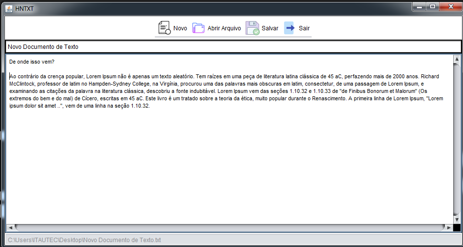
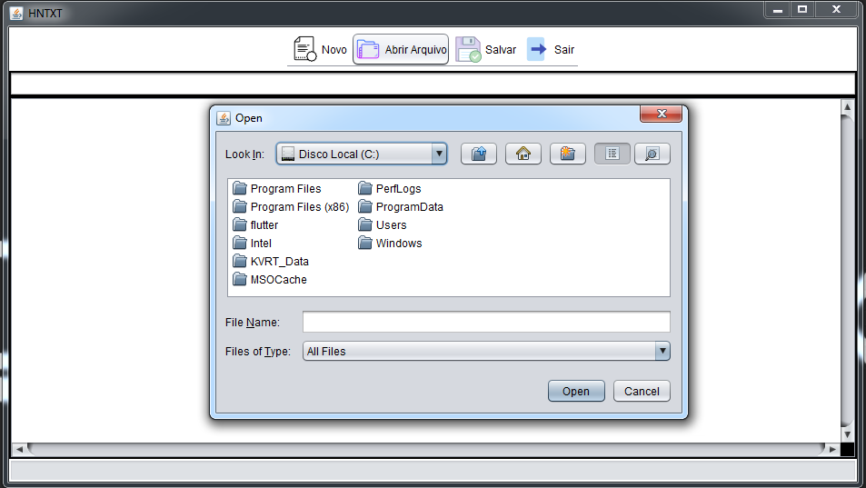
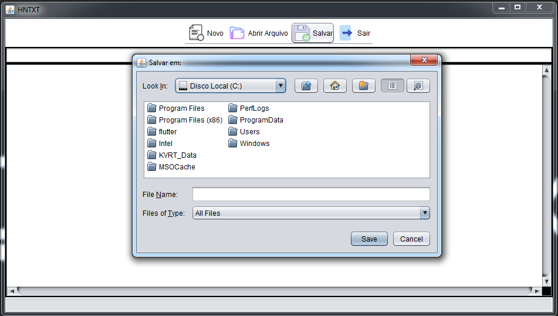
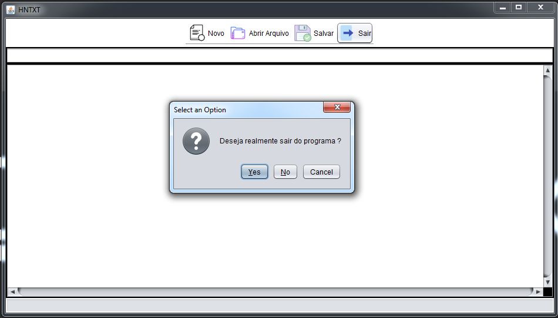

# HNTXT (Projeto em Desenvolvimento)
Criando um leitor e escrito de arquivos .txt
Utilizando api Swing para criar a GUI
Trabalhando com Listeners dos componentes do Swing
Trabalhando escrita e gravação de arquivos .txt

GUI em melhoria

<h3>Tela Inical </h3>

<h3>Selecionando arquivo a ser aberto </h3>

<h3>Escolha de local para salvar arquivo </h3>

Assim como no bloco de notas do windows, a escolha aparece somente uma vez, nas outras vezes que o usuário for salvar o aquivo, será salvo no caminho já predefinido

<h3>Confirmação para sair </h3>

 Desenvolvido por: Hermógenes Neto

 Tecnológo em Análise e Desenvolvimento de Sistemas

 Pós graduando em Desenvolvimento Orientado a Objetos com Java
